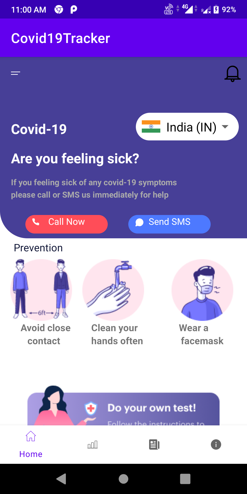
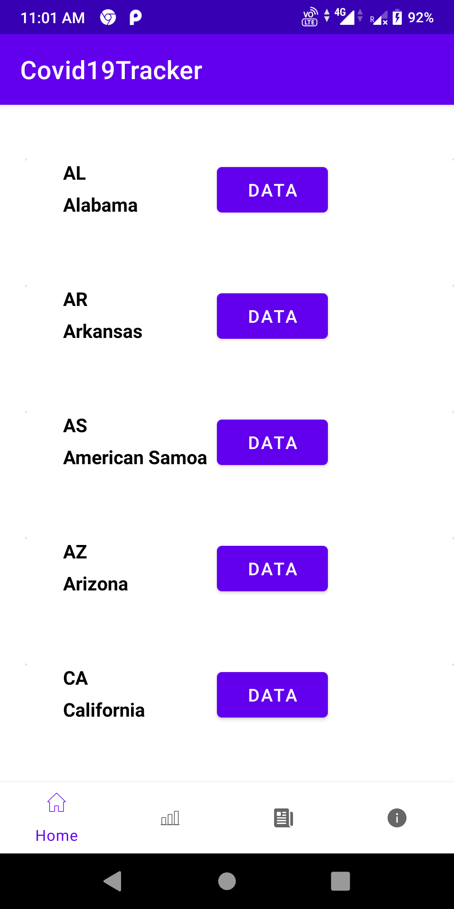
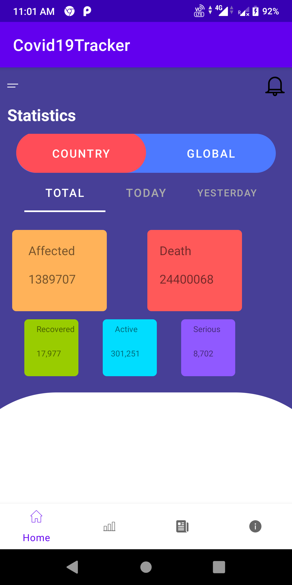

# Covid19Tracker Android App

Covid19Tracker is an Android App which will provide you the latest information of the Current death rate and positive cases,serious cases and recovered rate with respect to covid-19 of a particular city
Example - USA ( State - California - Death Rate - 1389707,Recovered Rate - 13977 and so on)

# Screenshots

# Libraries this app uses
###### Retrofit Libraries - 
                            implementation 'com.squareup.retrofit2:retrofit:2.6.0'
                             implementation 'com.squareup.retrofit2:converter-gson:2.5.0'
                            implementation 'com.squareup.okhttp3:logging-interceptor:3.12.3'

###### Circle Image View - 
                                implementation 'de.hdodenhof:circleimageview:3.1.0'
 ###### Glide -      
                    implementation 'com.github.bumptech.glide:glide:4.11.0'
                     annotationProcessor 'com.github.bumptech.glide:compiler:4.11.0'
  ###### ViewModel - 
                         implementation 'androidx.lifecycle:lifecycle-viewmodel-ktx:2.2.0'
   
   ###### CountryCodePicker - 
                           implementation 'com.hbb20:ccp:2.4.0'

# Permissions
###### Full Network Access

